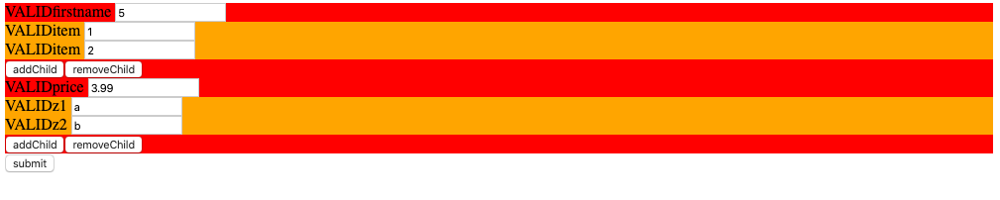
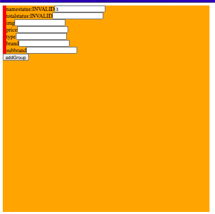

<h1 align="center"> React Formbuilder in an angular way</h1>

<p align="center">
  
</p>
<p align="center">
  
</p>
<p align="center">
React Formbuilder has asynchornous observables from rxjs
</p>


## Documentation

Get started with reactFormbuilder!


### Prerequisites
 have react installed.
 have react-dom installed.
 and only use functional programming when using the formbuilder.


# Formgroup

```json
   {
     validate: function => <null>,
     getHTML: function => <jsx|null>,
     removeControl: function(name) => <true|false>,
     addControl: function(obj) => <true|false>,
    value: <Object>

   }  // validated
```
# FormArray

```json
   {
     validate: function => <null>,
     removeControl: function(name) => <true|false>,
     addControl: function(obj) => <true|false>,
    value: <Array>

   }  // validated
```

# FormControl

```json
   {
     validate: function => <null>,
     removeControl: function(name) => <true|false>,
     addControl: function(obj) => <true|false>,
     value: <any>,
     state: {}
   }  // validated
```


 ## step1.

 # add the formbuilder.